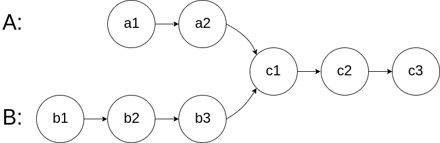
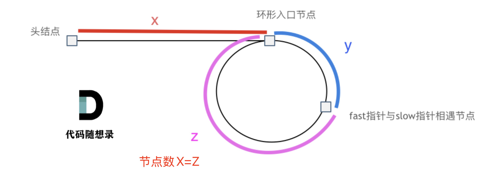
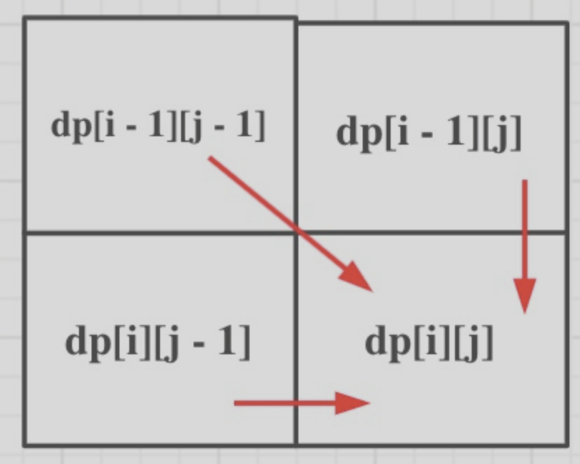
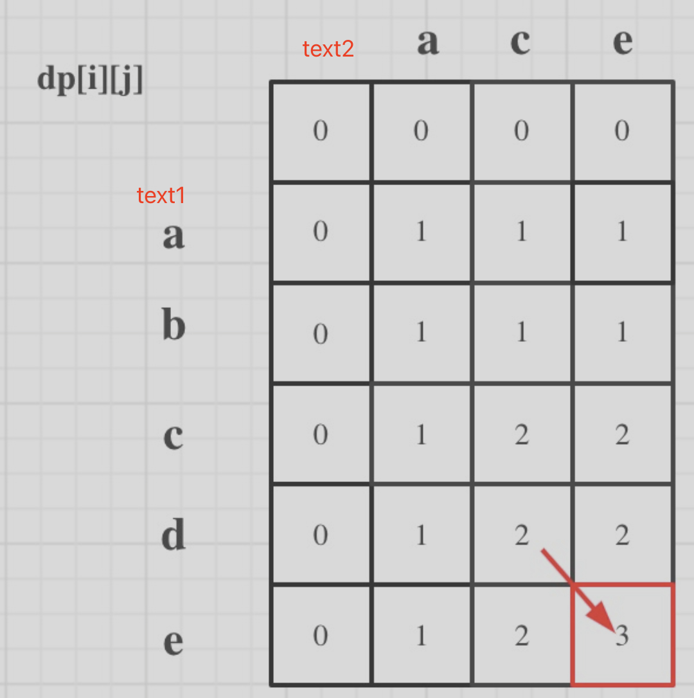
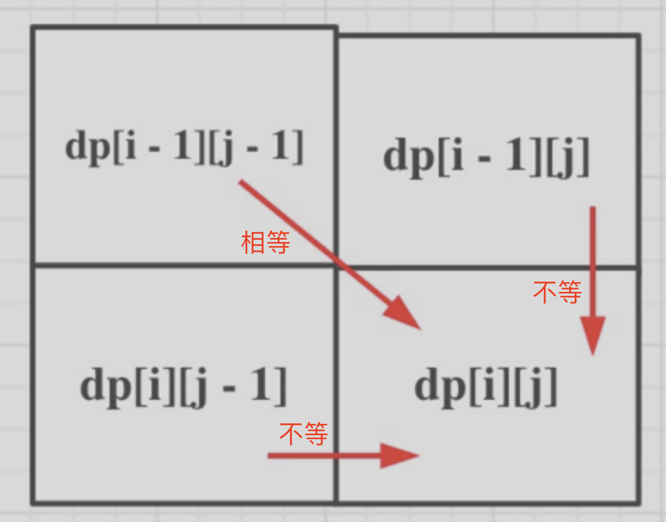

# Hot100解题思路


## 数组

### 1. 自身以外数组的乘积

思路：前缀乘   后缀乘，不包含自身

### 2. 轮转数组

思路：  

1. k%数组长度后，得到真实翻转次数
2. 整体翻转 + 左区间翻转+右区间翻转

```python
def rotate_array(nums, k):
    # 1. 确定真实轮转步数
    n = len(nums)
    k %= n  # 优化 k，防止多余的轮转

    # 2. 定义一个翻转函数
    def reverse(arr, start, end):
        while start < end:
            arr[start], arr[end] = arr[end], arr[start]  # 交换元素
            start += 1
            end -= 1
    # 3. 执行翻转
    reverse(nums, 0, n-1)  # 整体翻转   双闭区间
    reverse(nums, 0, k-1)  # 左区间翻转
    reverse(nums, k, n-1)  # 右区间翻转
```


### 3. 划分字母区间：字符串划分为尽可能多的片段，同一字母只能出现在一个片段中

思路：

1. 第一次遍历，统计每个字符的==最后出现位置==
2. 第二次遍历，每步都更新当前区间内的最远下标，如果`当前下标`等于`当前区间最远下标`，则找到分割点

```python
def partitionLabels(s: str):
    # 第一次遍历，统计每个字符最后出现的下标
    last_index = {char: idx for idx, char in enumerate(s)}
    
    # 初始化变量
    start = 0  # 当前区间的起始位置
    end = 0    # 当前区间的最远位置
    result = [] # 存储划分的结果
    
    # 第二次遍历，划分字符串
    for i, char in enumerate(s):
        # 更新当前区间的最远位置
        end = max(end, last_index[char])
        
        # 如果当前下标等于当前区间的最远位置，找到分割点
        if i == end:
            result.append(i-start+1)  # 记录区间长度
            start = i + 1  # 更新下一个区间的起始位置
    
    return result
```

### 4. 合并区间:  合并所有重叠的区间，并返回不重叠的区间数组

思路：

1. 排序：按照子数组的第一个元素排序  `nums.sort(key=lambda x:x[0])`
2. 逐步合并：按照第二个元素合并，分不重叠、重叠、包含3种情况  

   ```python
   pre_left,pre_right = result[-1]  # 结果里的最后一个区间
   cur_left,cur_right = intervals[i] # 当前区间
   ```

```python
# 边界条件
if not intervals:
    return []
# 1. 按照区间的起始位置排序
intervals.sort(key=lambda x: x[0])

# 2. 逐步合并区间
result = [intervals[0]]  # 初始化结果列表，首先加入第一个区间
for i in range(1, len(intervals)):
    pre_left, pre_right = result[-1]  # 结果中的最后一个区间
    cur_left, cur_right = intervals[i]  # 当前区间

    # 判断是否重叠
    if cur_left <= pre_right:  # 有重叠
        result[-1] = [pre_left, max(pre_right, cur_right)]  # 合并区间
    else:  # 没有重叠
        result.append([cur_left, cur_right])  # 直接加入当前区间
return result
```


### 5. 最大子数组的和

思路：  

1. 更新当前的前缀和 
   - 如果之前>0，则对当前有益  更新为prefix+当前值。
   - 如果之前<0，则对当前有害  重置为当前值
2. 更新当前的最大值  

```python
if not nums:
    return 0

# 初始化前缀和和最大和
prefix = nums[0]  # 当前子数组的前缀和
max_sum = nums[0]  # 最大子数组的和

# 从第二个元素开始遍历
for i in range(1, len(nums)):
    # 如果前缀和大于0，对当前值有益，更新前缀和
    # 否则，重置前缀和为当前值
    prefix = max(nums[i], prefix + nums[i])

    # 更新最大和
    max_sum = max(max_sum, prefix)

return max_sum
```


### ⭐️7. 三数之和

思路： [links](https://www.programmercarl.com/0015.%E4%B8%89%E6%95%B0%E4%B9%8B%E5%92%8C.html#%E5%85%B6%E4%BB%96%E8%AF%AD%E8%A8%80%E7%89%88%E6%9C%AC)

1. 排序 + 左右指针  
2. 过滤重复值：基准值判断前一个元素是否重复、左右指针判断下一个元素是否重复

```python
result = []
nums.sort()
for i in range(len(nums)-2): # 必须三个数
    # # 第二个元素开始 判断当前元素与之前元素重复则跳过
    if i > 0 and nums[i] == nums[i-1]:
        continue

    left，right = i + 1，len(nums) - 1
    while left<right: # 不要等号  必须三个数
        total = nums[i] + nums[left] + nums[right]
        if total < 0:
            left += 1
        elif total > 0:
            right -= 1
        else:
            result.append([nums[i], nums[left], nums[right]]) # 记录一组解
            # 两者都判断下一个元素，过滤相同解
            while left<right and nums[right] == nums[right-1]:
                right -= 1
            while left<right and nums[left] == nums[left+1]:
                left += 1
            # 走到相同元素的边界，再走一步
            right -= 1
            left += 1
return result
```

### 8. 和为 K 的子数组：整数数组 nums 和一个整数 k ，统计和为 k 的子数组的个数 

思路： 用前缀和+哈希表

- 哈希表{前缀和：出现次数}，如果 `当前前缀和−k的区间和j` 在哈希表，则总次数 累加上`map[j]`的值。

- 初始化为{0:1}   表示前缀和为0出现了1次，避免漏掉从数组开头开始的子数组

### 9. 翻转字符串里的单词 

 思路： 全部翻转，再翻转每个单词

### 10. 移动零：所有 0 移动到数组的末尾

思路：快慢指针，快指针持续走到 满足条件的元素，与慢指针交换。然后同时右走

### 11. 最长连续序列 ：未排序的整数数组 nums ，找出数字连续的最长序列

（不要求序列元素在原数组中连续）      

思路：每个数判断是否为连续序列的开头。

1. 用set判断是否包含当前元素-1。 跳过非开头
2. 递增 持续判断是否在集合里

### 12. 缺失的第一个正整数

思路： 理想情况下 下标+1=正整数

1. 交换：遍历到下标i,  如果值在1~n范围内，且与下标不匹配，需要持续交换。   

   - 终止条件是 即将交换的位置已经有匹配元素。

   -  必须理清 当前下标、当前值、交换下标、交换值。 交换前==下标不得嵌套==

2. 遍历：第一个与下标不匹配的元素即为缺失正整数

### ⭐️13. 接雨水

双指针思路： 1. 构建左最大值数组，包含自身  2. 右最大数组  3. 计算接水量，注意两侧柱子不存水

```python
class Solution:
    def trap(self, height: List[int]) -> int:
        # 边界条件
        if len(height)<3:
            return 0
        
        # 1. 构建左最大
        left_max=[0]*len(height)
        left_max[0]=height[0]
        for i in range(1,len(height)): 
            left_max[i]=max(left_max[i-1],height[i])
        
        # 2. 构建右最大
        right_max=[0]*len(height)
        right_max[-1]=height[-1]
        for i in range(len(height)-2,-1,-1):
            right_max[i]=max(right_max[i+1],height[i])
        # 3. 计算接水量
        count=0
        for i in range(1,len(height)-1):
            count+=max(min(left_max[i],right_max[i])-height[i],0)
        return count
```


## 矩阵

### 1. 遍历螺旋矩阵

1. 从外到内，一圈一圈顺时针遍历
2. 4个指针定义边界  top bottom  left  right
3. ==逆序遍历==时判断是否存在，即右边向左边需判断是否有该行、下面向上边 需判断是否有该列

```python
# 定义四个边界 
def spiralOrder(matrix):
    if not matrix:
        return []

    # 初始化边界   双闭区间
    top, bottom = 0, len(matrix) - 1
    left, right = 0, len(matrix[0]) - 1
    
    result = []
    
    while top <= bottom and left <= right:
        # 从左到右遍历该行
        for i in range(left, right + 1): 
            result.append(matrix[top][i])
        top += 1  # 遍历完移到下一行
        
        # 从上到下
        for i in range(top, bottom + 1):
            result.append(matrix[i][right])
        right -= 1
        
        # 从右到左遍历行  !!!先判断是否还有行!!!
        if top <= bottom: 
            for i in range(right, left - 1, -1):
                result.append(matrix[bottom][i])
            bottom -= 1
        
        # 从下到上遍历列   !!!先判断是否还有列!!!
        if left <= right:
            for i in range(bottom, top - 1, -1):
                result.append(matrix[i][left])
            left += 1
    
    return result
```

### 2. 矩阵顺时针旋转90°  

思路：矩阵对角线交换+每行翻转

## 二分查找

### 1. 搜索二维矩阵

思路： 坐标映射到一维，进行二分查找

## 排序

### 1. 查找数组第K大的元素

思路：堆排序

```python
def findKthLargest(nums, k):
    # 1. 堆化  从当前元素自顶向下全部递归堆化
    def max_heap(nums,length,i):
        # 2个终止条件 （1）叶子节点 （2）当前节点非叶子节点，但已是最大值，无需交换
        left,right=2*i+1,2*i+2 # 左右孩子
        if left>=length and right>=length:  # 没有孩子，属于叶子结点
            return 
	
        # 合理区间内最大值下标  判断是否需要交换
        largest=i
        if left<length and nums[largest]<nums[left]:  
            largest=left
        if right<length and nums[largest]<nums[right]:
            largest=right
        if largest==i: 
            return

        #  单层递归逻辑  交换并向下持续堆化
        nums[i],nums[largest]=nums[largest],nums[i]
        max_heap(nums,length,largest)

    # 2. 建堆：从最后一个非叶子节点开始到根节点，构建最大堆
    def build_max_heap(nums):
        length=len(nums)
        for i in range(length//2-1,-1,-1): # 最后一个非叶子节点 --> 根节点
            max_heap(nums,length,i)
    build_max_heap(nums)

    # 3. 出堆  移除k-1个元素，堆顶就是第k大的元素
    for i in range(len(nums)-1,len(nums)-k,-1): # 左闭右开，差值就是元素个数
        # （1）交换堆顶和堆底元素  （2）缩小堆范围 从根节点堆化
        nums[0],nums[i]=nums[i],nums[0]
        # i指堆范围，持续缩小堆范围 堆结尾从n-1缩小为n-k+1,代表移除k-1个元素
        max_heap(nums,i,0) 
    return nums[0]
# 示例
nums = [3, 2, 1, 5, 6, 4]
k = 2
print(findKthLargest(nums, k))  # 输出应该是 5
```


## 链表

### 1. 链表相交，求交点



思路：

1. 链表A走A+B路程，链表B走B+A路径。持续比较 两个节点。
2. 终止条件是两个节点相等，中途相等则相交，都走完则不想交。

### 2. 环形链表判断是否有环？环入口？



1. 快慢指针相遇，则有环。
2. 相遇时，慢节点回到头节点，快慢指针同步走，再次相遇是入口

### 3. 回文链表

思路：快慢指针找中点，翻转后半 再同时遍历两个链表

### 4. 翻转链表

思路：3个指针  新链表表头new_node、旧链表当前节点cur_node、旧链表下一个节点next_node

### 5. 链表模拟两数之和 

思路：少的链表高位为0、考虑进位

### 6. 删除倒数第N个节点

思路：虚拟头结点+快慢指针


## 栈Stack

### （一）普通栈

#### ⭐️1. 字符串解码 

例如"3[a]2[bc]&quot;解码为&quot;aaabcbc"

思路：

1. 遇到 [   栈存入已解码的字符串 + 即将重复的数字
2. 遇到]   栈弹出 已解码字符串和即将重复数字，拼成新字符串

```python
stack=[] 
cur_strr="" # 存储已解码的字符串
cur_num=0 # 存储即将解码的数字

for char in s: # 4种可能
    if char.isdigit(): 
        cur_num=cur_num*10+int(char) # 连续数字
    elif char=="[":
        # 入栈  保存已解码字符串 + 即将解码的数字
        stack.append([cur_strr,cur_num])
        # 清空
        cur_strr=""
        cur_num=0
    elif char =="]":
        # 出栈解密
        pre_str,nums=stack.pop()
        cur_strr=pre_str+ cur_strr*nums # 当前字符串是要重复的目标
    else:
        cur_strr+=char # 字母
return cur_strr
```

### （二）单调栈

#### 1. 获取最小元素的栈

思路：额外维护一个单调栈，与原数组长度一致

#### 2. 每日温度

```python
stack=[0]
result=[0]*len(temperatures)
for i in range(1,len(temperatures)): 
    # 当前元素  > 栈顶元素
    if temperatures[i]>temperatures[stack[-1]]:
        while len(stack)>0 and temperatures[i]>temperatures[stack[-1]]:
            index=stack.pop()
            result[index]=i-index
        stack.append(i)
    # 当前元素<=栈顶元素
    elif temperatures[i]<=temperatures[stack[-1]]:
        stack.append(i)
return result
```


#### 3. 柱状图中最大的矩形❓

[视频讲解](https://www.bilibili.com/video/BV1Ns4y1o7uB?buvid=ZB4C53B2BBD061C34F8EB053DCC8271B5A7F&from_spmid=main.space-contribution.0.0&is_story_h5=false&mid=vFwLKO%2BwKIe1OV8Bmn8djA%3D%3D&plat_id=114&share_from=ugc&share_medium=iphone&share_plat=ios&share_session_id=63D630E1-0B89-43AD-9F25-8DCA15FA1DDB&share_source=WEIXIN&share_tag=s_i&timestamp=1735483510&unique_k=DGVdx3b&up_id=525438321&vd_source=867a12dbe5f2199cb2f7283321debf90)

思路：每个元素找到其前后最近的更小位置

```python
def largestRectangleArea(heights):
    # 在柱子高度前后添加哨兵 0,防止极端情况无法计算
    heights = [0] + heights + [0] 
    stack = []  # 单调栈存储柱子的索引
    max_area = 0  # 最大矩形面积

    # 遍历所有柱子
    for i in range(len(heights)):
        # 当前元素小于栈顶元素时，计算矩形面积
        while stack and heights[i] < heights[stack[-1]]:
            h = heights[stack.pop()] # 弹出栈顶元素索引
            width = i - stack[-1] - 1  # 矩形宽度为两栈顶索引的差值减 1
            max_area = max(max_area, h * width)
        stack.append(i)  # 当前柱子索引入栈
    return max_area
```


## 滑动窗口（左闭右开）

### 1. 无重复字符的最长子串

题目描述:  找出其中不含有重复字符的最长子串的长度。输入s = "abcabcbb"  输出: 3,即"abc" 

思路：滑动窗口用set  添加add  移除remove，记录窗口内每个字符是否出现

```python
# 动态窗口
# 1. 什么时候扩大窗口？ 每步都在扩大
# 2. 什么时候收缩窗口？ 窗口内都是不重复元素，如果当前右侧元素在窗口内出现重复值，一直收缩左侧元素直到窗口内不重复
# 3. 什么时候更新结果？ 收缩完记录结果

# 窗口参数
window = set()  # 用于记录当前窗口的字符
left, right = 0, 0  # 窗口为左闭右开 [left, right)
max_length = 0  # 记录最大长度
while right < len(s):  # 右边界移动范围是 0 到 n-1
    char = s[right]
    # 如果当前字符在窗口中，则收缩左边界  动态窗口
    while char in window:
        window.remove(s[left])
        left += 1
    # 将当前字符加入窗口
    window.add(char)
    # 更新最大长度
    max_length = max(max_length, right - left + 1)
    # 扩大右边界
    right += 1
return max_length
```

### 2. 最小覆盖子串

思路：统计频率，窗口用Counter

```python
def minWindow(self, s: str, t: str) -> str:
    
    # 窗口参数
    window = {} 
   	valid=0 # 单字符满足频次时+1
  	left，right, = 0,0 # 左闭右开[left,right)  区间[0, 0)中没有元素，避免边界问题  窗口长度=right-left
    
    # 子串参数   
    from collections import Counter
    need=Counter(t) # "eex" --> Counter({'e': 2, 'x': 1})

    # 记录结果
    strat=0
    length=float("inf")
   
    while right<len(s):  # right值尚未加入窗口，取值范围是0~n-1 
        # 1. 判断当前元素 
        char=s[right] 
        if char in need.keys():
            window[char] = window.get(char, 0) + 1
            if window[char] == need[char]:
                 valid += 1 
        right+=1
        
        # 3. 判断是否收缩窗口
        while left<right and valid==len(need.keys()): 
            # 4. 记录结果
            if right-left<length:
              	start=left
                length=right-left
            # 5. 判断当前左侧元素是否移出窗口
            char = s[left]
            if char in need.keys():
              	if window[char] == need[char]:
                    valid-=1
                window[char]-=1
            # 6. 收缩左边界
            left+=1
		return "" if length==float("inf") else s[start: start + length]
```


## 二叉树

### 1. 验证二叉搜索树

思路：==中序遍历==成数组，再判断是否递增

### 2. 从前序和中序构建二叉树

思路： 递归不断拆分左右区间，构建左右子树

递归三步骤

1. 参数及返回值   输入前序、中序
2. 终止条件   输入序列长度为空
3. 单层递归逻辑
   1. 前序第一个节点 将中序拆成左右区间
   2. 用中序左区间长度 将前序业拆成左右区间
   3. 得到前序 中序的左右区间后递归即可

```python
def buildTree(preorder, inorder):
  	# 终止条件
    if not preorder or not inorder:
        return None

    # 前序遍历的第一个元素是当前树的根节点
    root_val = preorder[0]
    root = TreeNode(root_val) #新树节点

    # 找到根节点在中序遍历中的索引
    mid_idx = inorder.index(root_val)

    # 递归构建左子树和右子树
    root.left = buildTree(preorder[1:mid_idx + 1], inorder[:mid_idx])
    root.right = buildTree(preorder[mid_idx + 1:], inorder[mid_idx + 1:])

    return root
```


## 图论

### 1. 岛屿数量

思路：深度优先遍历DFS，每遍历到一个岛屿，就递归淹掉周围的陆地

1. 递归参数：    grid、当前坐标i和j
2. 递归终止条件：    （1）上下左右四边越界（2）当前位置已经是海水
3. 单层递归逻辑： 当前位置变为海水，再递归淹没上下左右

```python
# 岛屿数量
class Solution:
    def numIslands(self, grid: List[List[str]]) -> int:
        res=0 # 岛屿数量初始化为0
       
        # 遍历grid
        for i in range(len(grid)):
            for j in range(len(grid[0])):  
                if grid[i][j]=="1": # 发现岛屿
                    res+=1 # 岛屿数+1
                    self.dfs(grid,i,j) # 将岛屿周围淹掉
        return res
    def dfs(self,grid,i,j):
        # 递归终止条件 （1）上下左右四边越界 （2）当前已是海水
        if i<0 or j<0 or i>=len(grid) or j>=len(grid[0]):
            return 
        if grid[i][j]=="0": 
            return 

        
        grid[i][j]="0" # 淹没当前位置，再递归淹没淹没上下左右
        self.dfs(grid,i-1,j)
        self.dfs(grid,i+1,j)
        self.dfs(grid,i,j-1)
        self.dfs(grid,i,j+1)
```

### 2. 腐烂的橘子

思路：广度优先遍历BFS   

1. 队列装入腐烂橘子坐标，同时统计新鲜橘子数量
2. 遍历第一波，所有腐烂橘子同时上下左右传播一次，减少新鲜橘子数量。将新传染的橘子装入队列，进行下一波传染。
3. 全部传播完后判断是否还有新鲜橘子

```python
# 腐烂橘子
class Solution:
    def orangesRotting(self, grid: List[List[int]]) -> int:
        from collections import deque
        deq = deque()  # 保存腐烂橘子
        fresh_nums = 0  # 新鲜橘子的数量

        # 遍历整个网格，初始化腐烂橘子的坐标并统计新鲜橘子的数量
        for i in range(len(grid)):
            for j in range(len(grid[0])):
                if grid[i][j] == 1:
                    fresh_nums += 1  # 统计新鲜橘子
                elif grid[i][j] == 2:
                    deq.append((i, j))  # 添加腐烂橘子的位置
        
        # 如果没有新鲜橘子，直接返回0
        if fresh_nums == 0:
            return 0
        time = 0  # 耗时
        direct = [(-1, 0), (1, 0), (0, -1), (0, 1)]  # 上下左右四个方向
        while deq: # 开始第一波腐烂
            for _ in range(len(deq)):
                x, y = deq.popleft()  # 当前腐烂橘子的位置
                # 尝试上下左右传播腐烂
                for dx, dy in direct:
                    nx, ny = x + dx, y + dy
                    # 判断新位置处于合法区间，且是否为新鲜橘子
                    if 0 <= nx < len(grid) and 0 <= ny < len(grid[0]) and grid[nx][ny] == 1:
                        grid[nx][ny] = 2  # 1.将新鲜橘子腐烂
                        fresh_nums -= 1  # 2.新鲜橘子数量减少
                        deq.append((nx, ny))  # 3.将新腐烂的橘子加入第二波队列
            time += 1  # 第一波传染完毕，次数+1

				if fresh_nums == 0:
          	return time-1  #最后一次传播是多余的，所以-1
        else:
          	return -1  # 如果还有新鲜橘子，返回-1
```


## 回溯

### 1. 电话号码的字母组合

思路：横向遍历 单个数字对应的字母集合，纵向遍历 didigits的N个数字

### 2. 组合总和

candidates 和一个目标数 target ，找出 candidates 中所有可以使数字和为 target 的组合。

### ⭐️3. 分割回文串

[links](https://www.programmercarl.com/0131.%E5%88%86%E5%89%B2%E5%9B%9E%E6%96%87%E4%B8%B2.html#%E7%AE%97%E6%B3%95%E5%85%AC%E5%BC%80%E8%AF%BE)

```python
# 131.分割回文串: 分割成子串，每个子串都是回文串
result，path = [],[]  # 全局参数存结果
startIndex=0 # 切割线
def backtracking(s,startIndex):
    # 终止条件
    if startIndex == len(s):
        result.append(path.copy()) # 切完说明整个字符串切成回文  必须复制
        return
    for i in range(startIndex, len(s)): # i取值0~n-1
      	strr=s[startIndex:i+1]  # 切出来的子串
        if strr == strr[::-1]: # 如果回文，才继续剩余部分的切分 
            path.append(strr)
            backtracking(s, i+1) # 纵向 从下一字符切割，判断其余是否仍为回文串
            path.pop() # 回溯
backtracking(s,startIndex)
return result
```

## 贪心

### 1. 买卖股票的最佳时机，只能买卖一次

思路：每个元素找右侧的最大值，从右向左构建最大栈

### 2. 跳跃游戏

题目：数组中的每个元素代表你在该位置可以跳跃的最大长度。判断是否能跳到最后一个下标。

思路：关注最大跳跃范围是否到达下标n-1位置

1. 每移动一个单位，先判断是否能到达   每步都更新最远范围
2. 如果能到达，更新最远覆盖范围，同时判断是否>=下标n-1位置

```python
def canJump(nums):
    max_reach = 0  # 最远覆盖的下标
    for i in range(len(nums)):
        # 终止条件  如果当前下标已经无法到达
        if i > max_reach:
            return False       
        max_reach = max(max_reach, i + nums[i]) # 每步更新最远范围 
        # 如果已经可以到达最后一个位置，返回 True
        if max_reach >= len(nums)-1:
            return True
    # 遍历结束后依然没能到达最后一个下标
    return False
```

### 3. 跳跃游戏II：返回最小跳跃次数

思路：最少步数走最远范围    

1. cur_range    当前能走的最远下标
2. next_range   在cur_range范围内，每走一步都更新最远范围
3. step  记录最小步数。一切以i为准,判断是否走到头、再是否到达目的地。最后的步数就是最少步数

```python
def jump(nums):
    n = len(nums)
    if n <= 1:
        return 0  # 只有一个元素时，不需要跳跃

    cur_range = 0  # 当前能到达的最远下标
    next_range = 0  # 下一步可以到达的最远下标
    steps = 0  # 步数
    
    for i in range(n):
        next_range = max(next_range, i + nums[i]) # 更新下一步的最远范围
        
        # 如果遍历到当前能跳跃的最远位置
        if i == cur_range:
            steps += 1  # 需要跳跃一次
            cur_range = next_range  # 更新当前能跳跃的最远位置
            
            # 如果当前能跳到或超过最后一个位置，结束
            if cur_range >= n - 1:
                return steps  
    return steps
```


## 动态规划

### （一）常规问题

#### 1. 杨辉三角

思路：填充二维dp数组的左下三角，第一列和对角线全为1，剩余元素=左+上

#### 2. 打家劫舍，不能偷相邻房屋

思路：

1. dp[i]定义   房间序号从==前i个房间==内偷的最高金额
2. 如果偷房间i，则最多考虑dp[i-2]

如果不偷房间i，则最多考虑dp[i-1]

```python
dp[i]= max(dp[i-2]+nums[i], dp[i-1])
```

#### 3. 乘积最大子数组，元素有正有负

思路：因为元素存在负数，导致最大值 最小值相互转换，所以同时维护两个dp_max   dp_min

1. dp定义   第 i 个元素结尾的乘积最大子数组的乘积

2. 公式   

   ```python
   dp_max[i] = max( nums[i], dp_max[i-1]*num[i], dp_min[i-1]*num[i]) 
   dp_min[i] = min(nums[i], dp_max[i-1]*num[i], dp_min[i-1]*num[i] )
   ```

   

### （二）背包问题

#### ⭐️1. 完全平方数（完全背包+组合问题+最少物品数）

背包容量是n， 物品是i  取值范围是0~√n

1. dp定义：dp[i] 和为i的最少数量
2. 递推公式  `dp[j]=min(dp[j-i²], dp[j])`    i取值范围`1~√n`
3. 初始化  `dp[0]=0`  为求最小值，故dp初始化为无穷大

```python
dp = [float('inf')] * (n + 1)
dp[0] = 0
for i in range(int(n**0.5) + 1):  # 先物品 根号n
    for j in range(i*i, n+1):  # 后背包
        # 更新凑成数字 j 所需的最少完全平方数数量
        dp[j] = min(dp[j],dp[j-i*i]+1)
return dp[n]
```

#### 2. 分割等和子集（01背包+组合问题+刚好装满）

题目：数组分割成两个子集，使得两个子集的元素和相等 

思路： 找到集合里能够出现 `sum/2` 的子集总和。01背包 + 组合问题

- dp定义：dp[i] 用nums数组的元素组合，使得恰好等于容量i   False装不成  True正好装满
- 递推公式  dp[i] 当背包容量大于物品j的容量nums[j]时  验证dp[i] or dp[i-nums[j]]
- 顺序:  先物品后背包  一维dp内层倒序

```python
# 边界条件
if sum(nums)%2!=0:
    return False
target=sum(nums)//2
dp=[False]* (target+1) # 0代表空背包  下标从1~n代表容量 全部初始化为False

dp[0]=True
for i in range(len(nums)): # 先物品  i下标0~n-1
    for j in range(target,nums[i]-1,-1): # 再背包  j下标n~1  01背包内层倒序
        dp[j]= dp[j] or dp[j-nums[i]]
return dp[target]
```

#### 3. 单词拆分（完全背包+排列问题+刚好拼成）

[Links](https://www.programmercarl.com/0139.%E5%8D%95%E8%AF%8D%E6%8B%86%E5%88%86.html)  单词列表是否能拼出字符串（完全背包）

1. 定义  dp[i] 字符串前i个元素（下标从0~i-1）能否拼出， False拼不出 True能拼出。0表示空，下标对应元素s[i-1] 

2. 递推公式  dp[i] 依赖于  如果dp[j]=True (0<=j<i)且s[j:i]出现在wordDict，则dp[i]=True   

   dp[j] 代表前j个元素,即s[0:j]，dp[i]代表前i个元素,即s[0:i]，故dp[j] ->dp[i]中间的字符串是 s[j:i]

3. 初始化   dp[0]=True

4. 顺序    排列顺序特殊  先背包后物品

```python
dp=[False] *(len(s)+1) # dp[i] 表示字符串的前 i 个字符是否可以被拆分成单词
dp[0]=True # 空字符True

for i in range(1,len(s)+1):  # 背包容量 1~n
    for j in range(i): # 物品j  0~i-1  
        #判断当前是否拼出
        if dp[j] and s[j:i] in wordDict: # 如果dp[j]能拼成，且s[j:i] 在单词集合中存在，则 s[0:i] 可以被拆分成单词
            dp[i]=True
            break
return dp[-1]
```

### （三）子序列问题

#### ⭐️1. 最短编辑距离

[links](https://www.programmercarl.com/0072.%E7%BC%96%E8%BE%91%E8%B7%9D%E7%A6%BB.html#%E7%AE%97%E6%B3%95%E5%85%AC%E5%BC%80%E8%AF%BE)  两个单词 word1 和 word2，将 word1 转换成 word2 所使用的最少操作数 

1. dp定义： word1前i个字符 word2前j个字符的最小编辑距离

2. 递推公式

   - 如果当前两个元素相等，则不操作 `dp[i][j] = dp[i-1][j-1]`

   - 不相等，需要增删改  `min(dp[i-1][j]+1, dp[i][j-1]+1, dp[i-1][j-1]+1)`

     - 删除/增加：word1删除则`dp[i-1][j]+1`   或者  word2删除 `dp[i][j-1]+1)`。word1删除一个字符   等价于 word2增加一个字符，删除和增加是等价的

     - 更改：`dp[i-1][j-1]+1`

3. 顺序

   

   

   

```python
class Solution:
    def minDistance(self, word1: str, word2: str) -> int:
        # word1是行   word2是列  从空开始,下标1~n代表元素word[i-1]
        # dp[i][j]  word1前i个字符 word2前j个字符的最小编辑距离
        # 递推公式
            # 当前两个元素如果相等，则不操作 dp[i-1][j-1]
            # 不等，需要 插入==删除、 替换。取最小
            	# 删除  dp[i-1][j]+1   dp[i][j-1] +1  
            	# 替换  dp[i-1][j-1]+1 
        dp=[ [float("inf")] * (len(word2)+1)  for _ in range(len(word1)+1)]

        # 初始化
        for i in range(len(word1)+1): # 取值范围1~n
            dp[i][0]=i
        for j in range(len(word2)+1): # 取值范围1~n
            dp[0][j]=j
        
        for i in range(1,len(word1)+1):
            for j in range(1,len(word2)+1):
                # 当前元素是否相等
                if word1[i-1]==word2[j-1]:
                    dp[i][j]=dp[i-1][j-1]
                else:
                    # 删除  插入等价
                    dp[i][j]=min(dp[i-1][j],dp[i][j-1],dp[i-1][j-1])+1
        return dp[-1][-1]
```

#### ⭐️2. 最长回文子串

[links](https://github.com/youngyangyang04/leetcode-master/blob/d3ae53e107a871c73b2d08094d586a9b711ee105/problems/0005.%E6%9C%80%E9%95%BF%E5%9B%9E%E6%96%87%E5%AD%90%E4%B8%B2.md)

```python
# ==============动态规划解法==============
def longestPalindrome(s) :
    dp = [[False] * len(s) for _ in range(len(s))]
    result = 0
    for i in range(len(s)-1, -1, -1): #注意遍历顺序
        for j in range(i, len(s)):
            if s[i] == s[j]:
                if j - i <= 1: #情况一 和 情况二
                    result += 1
                    dp[i][j] = True
                elif dp[i+1][j-1]: #情况三
                    result += 1
                    dp[i][j] = True
    return result

# ==============双指针解法==============
def longestPalindrome(s) :
    # 奇数串  偶数串
    def expand(s,left,right):
        # 合法区间内往外拓展 找最长子串
        while left>=0 and right<len(s) and s[left]==s[right]:
            left-=1
            right+=1
        return s[left+1:right] # 终止时多外扩了一次  故收缩一下

    long_str=""
    for i in range(len(s)):
        odd_str= expand(s,i,i)  # 以 s[i] 为中心的最长回文子串
        even_str=expand(s,i,i+1) # 以 s[i] 和 s[i+1] 为中心的最长回文子串
        long_str = max(long_str,odd_str,even_str,key=len)
    return long_str
```

#### 3. 最长公共子序列

[Links](https://www.programmercarl.com/1143.%E6%9C%80%E9%95%BF%E5%85%AC%E5%85%B1%E5%AD%90%E5%BA%8F%E5%88%97.html)  两个字符串的最长公共子序列的长度



[Links](https://www.programmercarl.com/1143.%E6%9C%80%E9%95%BF%E5%85%AC%E5%85%B1%E5%AD%90%E5%BA%8F%E5%88%97.html)

1. dp定义：`dp[i][j]`   text1前i个字符，text2前j个字符的最长公共子序列   

   - 0代表空字符串    i下标1~n，对应元素text[i-1]

2. 递推公式：

   - text1[i-1] 与 text2[j-1] 当前字符相同，则`dp[i][j] = dp[i-1] [j-1]+1`
   - text1[i-1] 与 text2[ j-1]当前字符不同，则`dp[i][j] = max(dp[i-1][j], dp[i][j-1])`

3. 初始化：第一行 第一列都为空

4. 顺序

   

```python
class Solution:
    def longestCommonSubsequence(self, text1: str, text2: str) -> int:
        # 两个字符串都从空开始 故都加1    text1是行   text2是列
        dp = [[0] * (len(text2) + 1) for _ in range(len(text1) + 1)]
        
        for i in range(1, len(text1) + 1): # 1~m 对应元素text[i-1]
            for j in range(1, len(text2) + 1): # 1~n  对应元素text[j-1]
              	# 如果当前两个字符相等，则左上角位置+1
                if text1[i-1] == text2[j-1]: 
                    dp[i][j] = dp[i-1][j-1] + 1
                else:
                    dp[i][j] = max(dp[i-1][j], dp[i][j-1])
        # 返回最长公共子序列的长度
        return dp[len(text1)][len(text2)]
```

#### 4. 最长连续递增序列

[links](https://www.programmercarl.com/0674.%E6%9C%80%E9%95%BF%E8%BF%9E%E7%BB%AD%E9%80%92%E5%A2%9E%E5%BA%8F%E5%88%97.html)  整数数组中找出最长严格递增子序列的长度

[Links](https://www.programmercarl.com/0300.%E6%9C%80%E9%95%BF%E4%B8%8A%E5%8D%87%E5%AD%90%E5%BA%8F%E5%88%97.html#%E7%AE%97%E6%B3%95%E5%85%AC%E5%BC%80%E8%AF%BE)

1. dp定义: dp[i]表示以==第i个元素结尾==的最长递增子序列的长度。 i取值0~n-1，对应元素nums[i]
2. 递推公式：dp[i]依赖  `nums[i]>nums[j]`时`max(dp[i],dp[j]+1)`    j取值0~i-1
3. 初始化：每一个i，dp[i]起始大小至少都是1

```python
if len(nums) <= 1:
    return len(nums)
dp = [1] * len(nums) # i取值0~n-1
dp[0]=1 #初始化
for i in range(1, len(nums)): # 从第二个开始看递增子序列  范围1~n-1
    for j in range(i): # j取值0~i-1
        if nums[i] > nums[j]: # 大于才有机会更大
            dp[i] = max(dp[i], dp[j] + 1)    
return max(dp)
```


## 技巧

### 1. 只出现一次的数字，即某个元素出现一次，其余元素均出现两次

思路：异或运算，相同为0，不同为1

```python
result = 0
for num in nums:
    result ^= num
return result
```


------

以下内容暂时不看

分治法

​	1.	**分解**：将问题分解为若干规模较小的子问题。

​	2.	**解决**：递归地解决子问题，直到问题足够小，直接得出答案。

​	3.	**合并**：将子问题的解组合成原问题的解（如果需要）。

1. 20个球怎么用天平找到轻的那个？

思路

- **分组优化**：分三组最大化利用天平三种状态（左轻、右轻、平衡），相当于有效划分子问题。
- **问题规模缩减**：分法比二分法更高效，每次称重将规模缩减至三分之一。

2.  100层楼和两个球，最少的次数验证到哪一层楼球会碎掉？

思路

- **通过逐步递减楼层差距的方式，确保在最坏情况下，仍能在尽量少的尝试中找到目标楼层**。

- $$
  k + (k-1) + (k-2) + \dots + 1 \geq 100  
  $$

  $$
  \frac{k(k+1)}{2} \geq 100
  $$

  转成等差数列，k=14。最坏情况需要14次测试。

