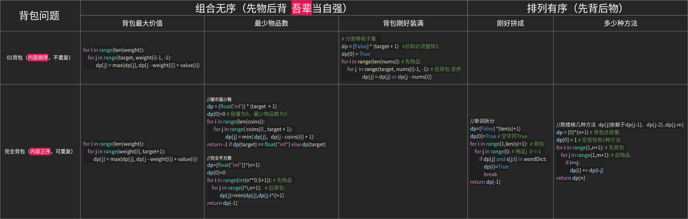

# 解题方法论

## 数组

### 1. 前缀和、区间和

​	前缀和：==明确定义==，即是否包含当前元素、遍历的范围

### 2. 查找算法

#### 二分查找（双闭区间）

- 时间复杂度O(logn)     
- 如果没找到，==left==指向目标即将插入的位置

##### 1. 查找目标值

```python
def binary_search(nums, target):
    left, right = 0, len(nums) - 1 # 循环不变量 双闭区间
    while left <= right: # 边界也要比 
        mid = (left + right) // 2
        # 必须列出所有情况
        if nums[mid] < target: 
            left = mid + 1  
        elif nums[mid] > target:
            right = mid - 1 
        elif nums[mid] == target:
            return mid
    return -1 
```

##### 2. 查找目标值的左右边界 

- 题目1：找左右边界
- 题目2：一个数字在升序数组中出现的次数     思路：右边界-左边界+1

==借助变量== 持续更新结果

```python
def search(nums, target) -> int:
    # ------左边界------
    left,right=0,len(nums)-1 
    final_left=-1 
    while left<=right:
        mid=(left+right)//2
        if nums[mid]>target:
            right=mid-1
        elif nums[mid]<target:
            left=mid+1
        elif nums[mid]==target:
            final_left=mid  # 更新结果
            right=mid-1     # 寻找左边界，收缩右边界
      
    # ------右边界------
    left,right=0,len(nums)-1 
    final_right=-1 
    while left<=right: 
        mid=(left+right)//2
        if nums[mid]>target:
            right=mid-1
        elif nums[mid]<target:
            left=mid+1
        elif nums[mid]==target:
            final_right=mid
            left=mid+1  # 寻找右边界，收缩左边界（唯一区别）
       
    return [final_left,final_right] 
```

##### 3. 旋转排序数组

[4, 5, 6, 7, 0, 1, 2] 无重复元素

|            | 比较      | 思路                                                 |
| ---------- | --------- | ---------------------------------------------------- |
| 查找目标值 | left  mid | 先判断左右区间有序，再判断目标值位于哪个区间         |
| 查找最小值 | mid right | 旋转点一定在无序区间内，用变量min_value持续更新mid值 |

###### （1）查找目标值

思路：先判断左右区间有序，再判断目标值位于哪个区间。 

1. 根据==左端点left==和==中点mid==，先判断左右区间有序，
2. 再判断目标值是否在有序区间，无法判断则left+1继续查找

```python
left,right=0,len(nums)-1
while left<=right: # 等于也要比 边界
    mid= (left+right)//2
    # 找到目标值，停止
    if nums[mid]==target:
        return mid

    if nums[left]<nums[mid]:  # 左区间有序  右区间无序
        if nums[left]<=target<nums[mid]: 
            right=mid-1
        else:
            left=mid+1
    elif nums[left]>nums[mid]: #左区间无序 右区间有序
        if nums[mid]<target<=nums[right]:
            left=mid+1
        else:
            right=mid-1
    elif nums[left]==nums[mid]:
        # 移到左边边界,继续查找
        left+=1 
return -1
```

###### （2）查找最小值

思路：（1）比较==中点mid==与==右端点right==     核心是无序区间旋转点（2）持续更新min_value

```python
left,right=0,len(nums)-1
min_value=float("inf") # 记录最小值
while left<=right:
    mid=(left+right)//2
    min_value = min(min_value,nums[mid])  # mid持续记录
    if nums[mid]>nums[right]: # 右边界无序
        left=mid+1
    elif nums[mid]<=nums[right]: # 左边界无序
        right=mid-1
return min_value
```

### 3. 排序算法

#### 快速排序QuickSort

时间复杂度O(nlogn) 

1. 确定基准值，左侧找小于基准值，右侧找大于基准值，持续交换
2. 将基准值 左右区间，递归排序。

```python
def swap(nums, left, right):
    """
    分区 选择一个基准元素,将数组分为两部分
    """
   # 以 nums[left] 作为基准数
   i,j=left,right
   base = nums[left]
   while i<j: # 等号无需交换
      while i < j and nums[i] <= base: # 左指针找到第一个大于基准的元素
         i += 1
      while i < j and base <= nums[j]: # 右指针找到第一个小于基准的元素 
         j -= 1
      if i < j: # 下标每次变动，都要判断
      	 nums[i], nums[j] = nums[j], nums[i] 
    nums[left], nums[i] = nums[i], nums[left] # 基准元素交换到对应位置，返回基准元素所在下标
    return i
def quicksort(nums, left, right):
    # 终止条件  等号不需要排序
    if left >= right:
      	return 
    # 单层递归逻辑   先分区，再排序左右区间
    base_index = swap(nums, left, right) # 返回基准值下标 
    quicksort(nums, left, base_index - 1)  
    quicksort(nums, base_index + 1, right) 
```

#### 堆排序Heap

- 题目：查找数组第K大的元素

[堆排序 核心思想](https://www.hello-algo.com/chapter_heap/heap/#3)  搞懂「堆化」、「建堆」和「出堆」的过程。 整体流程如下：

1. 堆化（递归）：从当前下标向下全部堆化

   1. 参数和返回值：3个入参  nums数组、length堆长度、i待堆化的下标

   2. 终止条件 （1）当前为叶子节点 （2）当前非叶子节点，但相比左右孩子已是最大值，无需交换

      ```python
      left,right=2*i+1, 2*i+2  # 左右孩子下标
      ```

   3. 单层递归逻辑：当前值 与最大值交换，继续向下堆化

2. 建最大堆：从最后一个非叶子节点开始到根节点，构建最大堆

   ```python
   length//2-1  # 最后一个非叶子节点的下标
   ```

3. 出堆：移除k-1个元素，堆顶就是第k大的元素

   1. 交换堆顶和堆底元素 
   2.  堆长度-1，堆顶执行堆化

- tips:  大小顶堆唯一区别是堆化时比较当前节点 > or <孩子。 

#### 归并排序

```python
# 两个数组合并后的中位数   
def merge_and_process(nums1, nums2):
    """
    合并两个有序数组，思路一样 合并两个有序链表
    """
    i, j = 0, 0
    merged = []
    # 合并两个有序数组
    while i < len(nums1) and j < len(nums2):
        if nums1[i] < nums2[j]:
            merged.append(nums1[i])
            i += 1
        else:
            merged.append(nums2[j])
            j += 1
    merged.extend(nums1[i:]) # nums1可能剩余，追加
    merged.extend(nums2[j:])
    n = len(merged)
    if n % 2 == 1:
        return merged[n // 2] #奇数长度
    else:
        return (merged[n//2-1] + merged[n//2])/2 # 偶数长度
```

### 4. 滑动窗口（左闭右开）

#### 1. 解题2步骤

1. 初始化参数 

   （1）滑动窗口参数：windows={}   标识符valid=0     left,right=0,0**左开右闭**，避免边界问题

   （2）子串参数need： 无重复字符用集合set()、统计字符频率用Counter

   （3）记录结果参数

2. 遍历字符串 `right<len(s)`   right是即将遍历的下标

   （1）判断当前元素，是否更新==窗口参数==（windows、valid、right）

   （2）判断当前元素，是否==收缩窗口==

   ​	     固定窗口  窗口已满 `if right-left>= len(子串)`

   ​		 动态窗口  合法区间内满足子串条件  `while left<right and valid==len(need.keys())`

   （3）收缩两步骤  （a）记录结果（b）左边界元素是否更新窗口参数（valid、windows、left）

[links](https://labuladong.online/algo/essential-technique/sliding-window-framework/#%E6%BB%91%E5%8A%A8%E7%AA%97%E5%8F%A3%E6%A1%86%E6%9E%B6%E6%A6%82%E8%A7%88)

### 5. 单调栈

应用：找下一个更大/更小元素

#### 1. 单调栈3步骤  

1. 明确 当前元素  和 栈顶元素 的`> < =`三种情况
2. 无论是否出栈，当前元素**下标**==最后必须入栈==

## 链表

核心解法：（1）快慢指针 （2）虚拟头结点  

### 1. 插入元素

#### 尾插

1. 保存下一个节点
2. 尾插      旧指None    新指旧
3. 新表更新尾节点
4. 旧表更新头结点

### 2. 翻转链表
思路：三个节点  新链表表头new_node   旧链表当前节点cur_node    旧链表下一个节点next_node

1. 保存旧链表下一个节点
2. 旧链表当前节点指向新链表头 
3. 更新新链表表头
4. 更新旧链表

```python
def reverse_linked_list(head):
    new_node = None  # 新链表 初始化为None
    cur_node = head  # 当前节点，初始化为链表的头节点

    # 遍历链表，直到当前节点为空   
    while cur_node:
        next_node = cur_node.next  # 1. 保存旧链表下一个节点
        cur_node.next = new_node  # 2. 将当前节点指向新链表头
        new_node = cur_node  # 3.更新新链表表头
        cur_node = new_node  # 4. 更新旧链表表头
    return new_node  # 返回新的头节点
```

### 3. 合并两个有序链表

时间复杂度为 O(m + n)

```python
def merge_two_lists(l1, l2):
    # 创建一个虚拟头节点，方便处理合并操作
    dummy = ListNode(0)
    cur_node = dummy  # 用于遍历和构建合并链表的指针

    # 遍历两个链表，直到其中一个链表为空
    while l1 and l2:
        if l1.val < l2.val:
            cur_node.next = l1
            l1 = l1.next  # 更新l1表头
        else:
            current.next = l2
            l2 = l2.next  # 更新l2表头
        
        # 更新新链表表头
        cur_node = cur_node.next

    # 剩余的节点接到新链表的末尾
    if l1:
        cur_node.next = l1
    if l2:
        cur_node.next = l2

    # 返回合并后的链表，去掉虚拟头节点
    return dummy.next
```

## 二叉树

### 1. 深度优先遍历DFS

#### 递归三步骤

1. 确定递归函数的参数和返回值
2. 确定终止条件  `node is None`
3. 确定单层递归的逻辑

```python
class Solution:
    def preorderTraversal(self, root: TreeNode) -> List[int]:
        res = []
        
        def dfs(node):
            # 终止条件 当前节点为空
            if node is None:
                return   
            # 前序  中左右
            res.append(node.val)
            dfs(node.left)
            dfs(node.right)
            
            # 中序  左中右
            #dfs(node.left)
            #res.append(node.val)
            #dfs(node.right)
            
            # 后续  左右中
            #dfs(node.left)
            #dfs(node.right)   
            #res.append(node.val)
        dfs(root)
        return res
```

### 2. 广度优先搜索（BFS）

#### [层序遍历](https://www.programmercarl.com/0102.%E4%BA%8C%E5%8F%89%E6%A0%91%E7%9A%84%E5%B1%82%E5%BA%8F%E9%81%8D%E5%8E%86.html#_102-%E4%BA%8C%E5%8F%89%E6%A0%91%E7%9A%84%E5%B1%82%E5%BA%8F%E9%81%8D%E5%8E%86)

1. 初始化队列deque ,装入根节点
2. 遍历当前层，记录并装入左右孩子
4. 装入当前层所有节点值

```python
# 利用长度法
# class TreeNode:
#     def __init__(self, val=0, left=None, right=None):
#         self.val = val
#         self.left = left
#         self.right = right
class Solution:
    def levelOrder(self, root: Optional[TreeNode]) -> List[List[int]]:
        # 边界条件   空树
        if not root:
            return []
        dq = collections.deque([root]) # deque双端队列  装入根节点
        result = []
        while dq: # 1. 遍历每一层
            # 2. 遍历当前层的节点   长度划分出当前层的元素个数，for pop遍历并清空当前层元素
            level = [] 
            for _ in range(len(dq) ): 
                cur_node = dq.popleft() 
                level.append(cur_node.val)
                # 3. 装入左右子树
                if cur_node.left: 
                    dq.append(cur_node.left)
                if cur_node.right:
                    dq.append(cur_node.right)
            result.append(level) # 4. 保存当前层结果
        return result
```

## 回溯

### 1. 回溯三步骤

1. 确定传参
   - 全局参数：path存放结果，result存放结果集
   - 保存结果==必须复制==

2. 确定终止条件 
3. 单层逻辑   **明确 **横向for遍历什么、递归纵向遍历什么

|      | 局部参数                           | 终止条件                                  | 横向                                                         | 纵向                                               |
| ---- | ---------------------------------- | ----------------------------------------- | ------------------------------------------------------------ | -------------------------------------------------- |
| 子集 | startIndex                         | startIndex==len(s) <br />先保存结果再终止 | range(startIndex, len(nums))                                 | backtrack(nums,i+1)                                |
| 组合 | startIndex                         | len(path)==len(nums)                      | range(startIndex,len(nums))                                  | backtrack(nums,i or i+1) <br />i重复取   i+1不重复 |
| 分割 | startIndex                         | startIndex==len(s)                        | range(startIndex, len(s)) <br />切出的子串`s[startIndex:i+1]` | backtrack(s,i+1)                                   |
| 排列 | used  <br />False未访问 True已访问 | len(path)==len(nums)                      | range(len(nums))   ==全遍历==                                | backtrack(nums,==used==)                           |

### 2. 应用

### （1）子集

```python
# leetcode78 返回所有可能的子集
result，path = [],[] # 全局参数
startIndex=0
def backtracking(nums,startIndex):
    result.append(path.copy())  # 记录结果，前序位置每个节点的值都是一个子集
    if startIndex == len(nums):  # 终止条件
        return
    for i in range(startIndex, len(nums)): # 横向
        path.append(nums[i])
        backtracking(nums, i+1) 
        path.pop()
backtracking(nums,startIndex)
return result
```

[Links](https://www.programmercarl.com/0078.%E5%AD%90%E9%9B%86.html#%E5%85%B6%E4%BB%96%E8%AF%AD%E8%A8%80%E7%89%88%E6%9C%AC)

### （2）组合无序  

```python
result，path = [],[] 
startIndex=0 
def backtracking(nums,startIndex):
    if 终止条件:  
        result.append(path.copy())  
        return 
    for i in range(startIndex,len(nums)): 
        path.append(nums[i])
        backtrack(nums,i) # 纵向 i依赖横向，控制纵向。i可重复,i+1不重复(画出N叉树就明白了)
        path.pop()
backtracking(nums,startIndex)
return result 
```

### （3）切割 

### （4）排列有序

需要穷举元素的位置  用**used**标记还可以选择哪些元素

```python
# leetcode46 全排列
result,path,=[],[] # 全局参数
used=[False]*len(nums)
def backtrack(nums,used):
    # 终止条件
    if len(path)==len(nums):
        result.append(path.copy()) # 复制结果
        return
    
    for i in range(len(nums)):
        if used[i]==True:
            continue # 跳过已访问的元素
        else:
            path.append(nums[i])
            used[i]=True
            backtrack(nums,used) # 纵向每次遍历整个数组，带着used
            path.pop()
            used[i]=False
backtrack(nums,used) 
```

## 贪心

### 1. 无套路

1. 千题千法，故不要在意数学证明。 
2. 思路：想清楚局部最优，想清楚全局最优，感觉可以推出，且想不出反例

## 动态规划

### 1. 动态规划5步骤

1. dp下标定义⭐️       明确下标 i 取值范围、总长度、对应值

2. 递推公式      更新依赖于哪些

3. 初始化

4. 遍历顺序    

5. 举例推导数组    

### 2. 背包问题


1. 背包容量从==0==开始
2. 明确3个问题   01背包or完全背包（确定正序or逆序）、组合or排列（确定顺序）、具体问题



### 3. 子序列问题

1. 子序列从==空字符==开始
