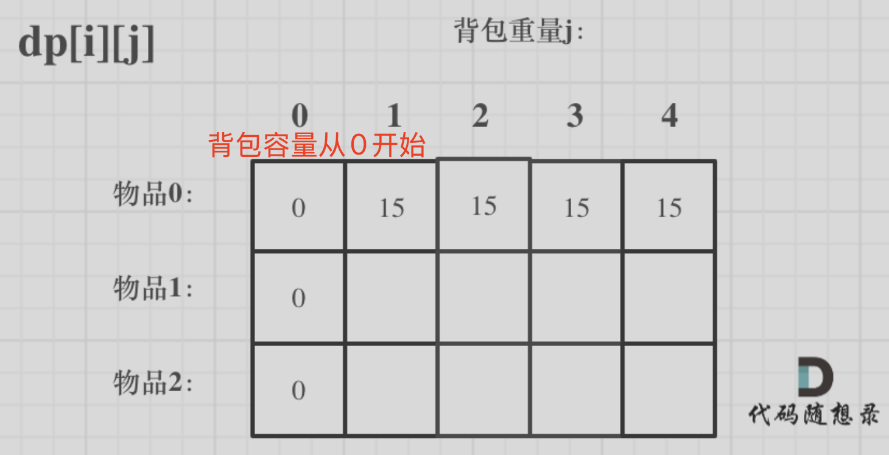

# 解题方法论


## 字符串

### 1. 字符串解码

&quot;3[a]2[bc]&quot;解码为&quot;aaabcbc"

```python
class Solution:
    def decodeString(self, s: str) -> str:
        stack=[] 
        cur_str="" # 存储已解码的字符串
        cur_num=0 # 存储即将解码的数字

        for char in s: # char4种可能
            if char.isdigit(): # 连续数字
                cur_num=cur_num*10+int(char)
            elif char=="[":
                # 入栈  保存已解码的字符串 + 即将解码的数字
                stack.append([cur_str,cur_num])
                # 清空
                cur_str=""
                cur_num=0
            elif char =="]":
                # 出栈
                pre_str,nums=stack.pop()
                cur_str=pre_str+ cur_str*nums # 当前字符串是要重复的目标
            else:
                cur_str+=char # 字母
        return cur_str
```


## 数组

### 1. 前缀和    区间和

### 2. 查找算法

#### 二分查找

时间复杂度O(logn)  

```python
def binary_search(nums, target):
    left, right = 0, len(nums) - 1 # 循环不变量 双闭区间
    while left <= right: # 双闭区间左右边界也要判断 需要等号检查最后一个元素
        mid = (left + right) // 2
        if nums[mid] == target:
            return mid
        elif nums[mid] < target:
            left = mid + 1  
        else:
            right = mid - 1 
    return -1
```

### 3. 排序算法

#### 快速排序QuickSort

先将一个元素排好序，然后再将剩下的元素排好序。时间复杂度O(nlogn) ，类似二叉树的前序遍历

```python
def partition(nums, left, right):
    """
    分区函数，选择一个基准元素,将数组分为两部分

    :param nums: 待排序的数组
    :param left: 排序的起始索引
    :param right: 排序的结束索引
    :return: 基准元素的最终位置
    """
   # 以 nums[left] 作为基准数
   i,j=left,right
   base = nums[left]
   while i<j: # 等号 不需要交换
      while i < j and nums[j] >= base: # 右指针找到第一个小于基准的元素，准备交换  
         j -= 1
      while i < j and nums[i] <= base: # 左指针找到第一个大于基准的元素，准备交换
         i += 1
      if i < j: # 每次变动序号，都要判断   交换两者
      	 nums[i], nums[j] = nums[j], nums[i] 
    nums[left], nums[i] = nums[i], nums[left] # 基准元素交换到对应位置，返回基准元素所在下标
    return i
def quicksort(nums, left, right):
    """
    :param nums: 待排序的数组
    :param left: 排序的起始索引
    :param right: 排序的结束索引
    """
    # 终止条件   等号不需要排序
    if left >= right:
      	return 
    i = partition(nums, left, right) # 基准元素的索引 
    quicksort(nums, left, i - 1)  # 左区间排序
    quicksort(nums, i + 1, right)  # 右区间排序
```

#### 堆排序

[核心思想](https://www.hello-algo.com/chapter_heap/heap/#3)

```python
def findKthLargest(nums, k):
    """
    找到数组中第K个最大的元素。
    
    :param nums: 一个整数数组
    :param k: 要找的第K个最大元素的位置
    :return: 第K个最大的元素
    """
    # 构建最大堆
    def build_max_heap(nums):
        length = len(nums)
        # 从最后一个非叶子节点开始，向上构建最大堆
        for i in range(length//2 - 1, -1, -1):
            max_heapify(nums, length, i)
    
    # 调整堆，使其满足最大堆的性质  如果子节点大于父节点，就交换它们，并递归调整子树。
    def max_heapify(nums, length, i):
        largest = i
        left = 2 * i + 1
        right = 2 * i + 2
        if left < length and nums[largest] < nums[left]:
            largest = left
        if right < length and nums[largest] < nums[right]:
            largest = right
        if largest != i:
            nums[i], nums[largest] = nums[largest], nums[i]
            max_heapify(nums, length, largest)
    
    build_max_heap(nums) # 构建最大堆
    for i in range(k - 1):
        nums[0], nums[-1] = nums[-1], nums[0]  # 交换堆顶和最后一个元素
        length = len(nums) - 1  # 减少堆的大小
        max_heapify(nums, length, 0)  # 重新调整堆
    return nums[0]  # 返回堆顶元素，即第K个最大的元素

# 示例
nums = [3,2,1,5,6,4]
k = 2
print(findKthLargest(nums, k))  # 输出应该是5，因为5是第二大的元素

```

### 4. 滑动窗口

#### 滑动窗口三步骤

- 什么时候扩大窗口？
- 什么时候缩小窗口？
- 什么时候更新答案？

```python
# 最小覆盖子串  
def minWindow(self, s: str, t: str) -> str:
    
    # 窗口参数
    window = {} 
   	valid=0 # 单字符满足频次时+1   值等于need长度时满足条件
  	left，right, = 0,0 # 左闭右开[left,right)   区间[0, 0)中没有元素，避免边界问题  窗口长度=right-left
    
    # 子串参数   无重复字符用Set() 统计字符频率用Counter
    from collections import Counter
    need=Counter(t) # "eex" --> Counter({'e': 2, 'x': 1})

    # 记录结果
    strat=0
    length=float("inf")
   
    while right<len(s):  # right是待处理的索引，取值范围是0~n-1    此时窗口内范围是left~right-1
        # 1. 判断当前元素 是否加入窗口,并更新标识符
        char=s[right] 
        if char in need.keys():
            window[char] = window.get(char, 0) + 1
            if window[char] == need[char]:
                 valid += 1 
				# 2. 扩大右边界
        right+=1
        
        # 3. 判断是否收缩窗口
        # if right-left >= len(t): # 固定窗口判断条件
        while left<right and valid==len(need.keys()): # 动态窗口判断条件
            # 4. 记录结果
            if right-left<length:
              	start=left
                length=right-left
            # 5. 判断当前左侧元素是否移出窗口
            char = s[left]
            if char in need.keys():
              	if window[char] == need[char]:
                    valid-=1
                window[char]-=1
            # 6. 收缩左边界
            left+=1
		return "" if length==float("inf") else s[start: start + length]
```

[links](https://labuladong.online/algo/essential-technique/sliding-window-framework/#%E6%BB%91%E5%8A%A8%E7%AA%97%E5%8F%A3%E6%A1%86%E6%9E%B6%E6%A6%82%E8%A7%88)

```python
无重复字符的最长子串: 找出其中不含有重复字符的最长子串的长度。
输入: s = "abcabcbb"  输出: 3,即"abc" 

# 动态窗口
# 1. 什么时候扩大窗口？ 每步都在扩大
# 2. 什么时候收缩窗口？ 窗口内都是不重复元素，如果当前右侧元素在窗口内出现重复值，一直收缩左侧元素直到窗口内不重复
# 3. 什么时候更新结果？ 收缩完记录结果
```


### 5. 单调栈❓

```python
def stack(nums):
    n = len(nums)
    result = [0] * n  # 根据题目初始化结果
    stack = []  # 栈中存储索引
    
    for i in range(n):  # 遍历数组
        # 根据条件调整栈顶元素
        while stack and <当前元素与栈顶索引元素满足条件>:
            idx = stack.pop()  # 弹出栈顶
            result[idx] = <根据题目更新结果>
        stack.append(i)  # 当前元素入栈
    
    return result
```

### 6. 矩阵顺时针遍历

```python
# 定义四个边界 
def spiralOrder(matrix):
    if not matrix:
        return []

    # 初始化边界   双闭区间
    top, bottom = 0, len(matrix) - 1
    left, right = 0, len(matrix[0]) - 1
    
    result = []
    
    while top <= bottom and left <= right:
        # 从左到右遍历该行
        for i in range(left, right + 1): 
            result.append(matrix[top][i])
        top += 1  # 遍历完移到下一行
        
        # 从上到下
        for i in range(top, bottom + 1):
            result.append(matrix[i][right])
        right -= 1
        
        # 从右到左遍历行  !!!先判断是否还有行!!!
        if top <= bottom: 
            for i in range(right, left - 1, -1):
                result.append(matrix[bottom][i])
            bottom -= 1
        
        # 从下到上遍历列   !!!先判断是否还有列!!!
        if left <= right:
            for i in range(bottom, top - 1, -1):
                result.append(matrix[i][left])
            left += 1
    
    return result
```

## 链表

### 1. 插入元素

#### 尾插

1. 保存下一个节点
2. 尾插      旧指None    新指旧
3. 新表更新尾节点
4. 旧表更新头结点

### 2. 翻转链表
思路：pre新链表    cur当前节点     next下一个节点

1. 旧链表保存下一个节点
2. 旧链表当前节点指向新链表头（翻转指针）
3. 新链表更新表头
4. 旧链表更新表头

```python
def reverse_linked_list(head):
    """
    :param head: 链表的头节点
    :return: 翻转后的链表头节点
    """
    prev = None  # 上一个节点，初始化为 None
    current = head  # 当前节点，初始化为链表的头节点

    # 遍历链表，直到当前节点为空   
    while current:
        next_node = current.next  # 1. 旧链表保存下一个节点
        current.next = prev  # 2. 将当前节点指向新链表头（翻转指针）
        prev = current  # 3.新链表更新表头
        current = next_node  # 4. 旧链表更新表头

    return prev  # 返回新的头节点
```

### 3. 合并两个有序链表

时间复杂度为 O(m + n)

```python
def merge_two_lists(l1, l2):
    # 创建一个虚拟头节点，方便处理合并操作
    dummy = ListNode(0)
    current = dummy  # 用于遍历和构建合并链表的指针

    # 遍历两个链表，直到其中一个链表为空
    while l1 and l2:
        if l1.val < l2.val:
            current.next = l1
            l1 = l1.next  # 更新l1表头
        else:
            current.next = l2
            l2 = l2.next  # 更新l2表头
        
        # 更新新链表表头
        current = current.next

    # 将 剩余的节点连到新链表的末尾
    if l1:
        current.next = l1
    if l2:
        current.next = l2

    # 返回合并后的链表，去掉虚拟头节点
    return dummy.next
```

## 二叉树

### 1. 深度优先遍历DFS

#### 递归三步骤

1. 确定递归函数的参数和返回值
2. 确定终止条件
3. 确定单层递归的逻辑

```python
class Solution:
    def preorderTraversal(self, root: TreeNode) -> List[int]:
        res = []
        
        def dfs(node):
            if node is None:
                return   
            # 前序  中左右
            res.append(node.val)
            dfs(node.left)
            dfs(node.right)
            
            # 中序  左中右
            #dfs(node.left)
            #res.append(node.val)
            #dfs(node.right)
            
            # 后续  左右中
            #dfs(node.left)
            #dfs(node.right)   
            #res.append(node.val)
        dfs(root)
        return res
```

### 2. 广度优先搜索（BFS）

#### [层序遍历](https://www.programmercarl.com/0102.%E4%BA%8C%E5%8F%89%E6%A0%91%E7%9A%84%E5%B1%82%E5%BA%8F%E9%81%8D%E5%8E%86.html#_102-%E4%BA%8C%E5%8F%89%E6%A0%91%E7%9A%84%E5%B1%82%E5%BA%8F%E9%81%8D%E5%8E%86)

1. 初始化队列 ,装入根节点
2. 遍历当前层节点
3. 记录当前节点，同时装入对应左右孩子
4. 装入当前层所有节点值

```python
# 利用长度法
# class TreeNode:
#     def __init__(self, val=0, left=None, right=None):
#         self.val = val
#         self.left = left
#         self.right = right
class Solution:
    def levelOrder(self, root: Optional[TreeNode]) -> List[List[int]]:
        # 边界   空树
        if not root:
            return []
        queue = collections.deque([root]) # deque双端队列  装入根节点
        result = []
        while queue: # 1. 遍历每一层
            # 2. 遍历当前层的节点   长度划分出当前层的元素个数，for pop遍历并清空当前层元素
            level = [] 
            nums=len(queue) # queue动态变化，必须先统计长度
            for _ in range(nums): 
                cur = queue.popleft() 
                level.append(cur.val)
                # 3. 装入左右子树
                if cur.left: 
                    queue.append(cur.left)
                if cur.right:
                    queue.append(cur.right)
            result.append(level) # 4. 保存当前层结果
        return result
```

## 图论

### 1. 深度优先遍历

岛屿数量

```python
class Solution:
    def numIslands(self, grid: List[List[str]]) -> int:
        res=0 # 岛屿数量初始化为0
       
        # 遍历grid
        for i in range(len(grid)):
            for j in range(len(grid[0])):
                # 判断当前元素 是否为1，即为岛屿
                if grid[i][j]=="1":
                    # 每发现一个岛屿，岛屿数+1
                    res+=1
                    # 用深度优先遍历DFS将岛屿淹掉
                    self.dfs(grid,i,j)
        return res
    def dfs(self,grid,i,j):
        # 递归终止条件  上下左右四边
        if i<0 or j<0 or i>=len(grid) or j>=len(grid[0]):
            # 超出索引边界  什么都不操作
            return 
        if grid[i][j]=="0":
            # 已经是海水  什么都不操作
            return 

        # 将（i，j）变为海水
        grid[i][j]="0"
        # 同时递归淹没上下左右陆地
        self.dfs(grid,i-1,j)
        self.dfs(grid,i+1,j)
        self.dfs(grid,i,j-1)
        self.dfs(grid,i,j+1)
```

### 2. 广度优先遍历

腐烂橘子

```python
class Solution:
    def orangesRotting(self, grid: List[List[int]]) -> int:
        from collections import deque
        # 1. 统计腐烂橘子坐标，统计新鲜橘子数量
        # 2. 腐烂橘子同时传播一次，减少新鲜橘子数量
        # 3. 全部传播完后判断是否还有新鲜橘子
        deq = deque()  # 保存腐烂橘子
        fresh_nums = 0  # 新鲜橘子的数量

        # 遍历整个网格，初始化腐烂橘子的坐标并统计新鲜橘子的数量
        for i in range(len(grid)):
            for j in range(len(grid[0])):
                if grid[i][j] == 1:
                    fresh_nums += 1  # 统计新鲜橘子
                elif grid[i][j] == 2:
                    deq.append((i, j))  # 添加腐烂橘子的位置
        
        # 如果没有新鲜橘子，直接返回0
        if fresh_nums == 0:
            return 0
        
        # 开始腐烂
        time = 0  # 耗时
        direct = [(-1, 0), (1, 0), (0, -1), (0, 1)]  # 上下左右四个方向
        while deq:
            # 当前这波腐烂的橘子数目
            for _ in range(len(deq)):
                x, y = deq.popleft()  # 获取当前腐烂橘子的位置
                # 尝试上下左右传播腐烂
                for dx, dy in direct:
                    nx, ny = x + dx, y + dy
                    # 判断新位置是否有效且是新鲜橘子
                    if 0 <= nx < len(grid) and 0 <= ny < len(grid[0]) and grid[nx][ny] == 1:
                        grid[nx][ny] = 2  # 1.将新鲜橘子腐烂
                        fresh_nums -= 1  # 2.新鲜橘子数量减少
                        deq.append((nx, ny))  # 3.将新腐烂的橘子加入第二波队列
            time += 1  # 第一波传染完毕，次数+1

        # 最后一次传播是多余的，所以-1

        # 如果还有新鲜橘子，返回-1，否则返回总时间
        return time - 1 if fresh_nums == 0 else -1
```

## 回溯

三步骤

1. 回溯函数模板 参数及返回值

   参数：path存放结果，result存放结果集，startIndex下一层for循环搜索的起始位置

2. 回溯函数终止条件

3. 遍历过程 （思考N叉树，横向遍历什么   纵向遍历什么）

```python
def backtracking(result,path,xxx): 
    if 终止条件:
        result.append(path[:])  # 存放结果 必须[:]返回新列表
        return   #返回
    for i in range(len(xxx)): #  结尾剪枝
        处理当前值
        backtrack(path,result,xxx)  # 如果有startIndex， i表示可重复  i+1不能重复取
        撤销当前值
# 定义全局变量
result,path=[],[]
backtracking(result,path,xxx)
return result 
```

## 动态规划

### 1. 动态规划5步骤

- dp下标定义⭐️⭐️⭐️       明确下标 i 取值范围、长度，以及对应元素的取值范围
- 递推公式      判断当前物品是否能装入背包
- 初始化
- 遍历顺序     先物后背，谐音**吾辈**当自强    求排列（特例，先背后物）
- 举例推导dp数组    

### 2. 01背包



#### （1）[二维dp](https://www.programmercarl.com/%E8%83%8C%E5%8C%85%E7%90%86%E8%AE%BA%E5%9F%BA%E7%A1%8001%E8%83%8C%E5%8C%85-1.html)
1. dp 定义：dp[i] [j]从下标为0~i的物品中任取，放入容量为j的背包的最大价值。
   - 物品i取值范围0~n-1
   - 背包j取值范围0~n   容量从0开始填充，故总长度+1
2. 递推公式


3. 初始化：填充第一行、第一列

   ```python
   # 初始化  背包从容量0开始填充，故+1   物品不变
   dp = [[0] * (capacity + 1) for _ in range(n)]
   for j in range(weight[0], capacity + 1):
       dp[0][j] = value[0]
   ```


#### （2）[一维dp](https://www.programmercarl.com/%E8%83%8C%E5%8C%85%E7%90%86%E8%AE%BA%E5%9F%BA%E7%A1%8001%E8%83%8C%E5%8C%85-2.html#%E7%AE%97%E6%B3%95%E5%85%AC%E5%BC%80%E8%AF%BE)

1. dp定义:  dp[j] 容量为j的背包，所背的物品最大价值

2. 递推公式:   不放物品i和放物品i两种情况

   ```python
   dp[j] = max(dp[j], dp[j - weight[i]] + value[i])
   ```

3. 初始化

   ```python
   dp = [0] * (capacity + 1)  # 初始值为0，背包容量从0开始填充，故+1
   dp[0] = 0  # 背包容量为0，最大价值为0
   ```

#### （3）应用场景

##### 1. 只取一次的背包最大价值

```python
# ===========二维dp===========
for i in range(1, n):  # 先物品  物品0已初始化,后续取值范围 1~n-1 
    for j in range(capacity + 1):  # 后容量  取值范围0~n
        if j >= weights[i]: 
          	dp[i][j] = max(dp[i-1][j], dp[i-1][j-weights[i]] + values[i])
        else: 
            dp[i][j] = dp[i-1][j]
     
    
# ===========一维dp===========
for i in range(n): # 物品
    for j in range(capacity, weight[i]-1, -1):  # 背包倒序  取值范围背包容量~物品i重量
      # 每次取得状态不会和之前重合，保证物品i只被放入一次。
      dp[j] = max(dp[j], dp[j - weight[i]] + value[i])
```

##### 2. 背包是否刚好装满

[分割等和子集](https://www.programmercarl.com/0416.%E5%88%86%E5%89%B2%E7%AD%89%E5%92%8C%E5%AD%90%E9%9B%86.html#%E7%AE%97%E6%B3%95%E5%85%AC%E5%BC%80%E8%AF%BE)   正好凑出sum/2    01背包 求组合 

```python
total_sum = sum(nums)
if total_sum % 2 != 0: # 总和的一半 能被2整除
    return False

target_sum = total_sum // 2
dp = [False] * (target_sum + 1) 
dp[0] = True

for num in nums: # 先物品
    for i in range(target_sum, 0, -1): # 背包 逆序n~1
        # 判断背包容量是否装入物品
        if i>=num:
        		dp[i] = dp[i] or dp[i - num]
return dp[target_sum]

```

### 3. 完全背包

唯一区别  **内层正序遍历**，保证物品重复放入

##### 1. 无限取的背包最大价值

```python
# ===========一维dp===========
dp = [0] * (bagWeight + 1)
for i in range(len(weight)):  # 物品
    for j in range(weight[i], bagWeight + 1):  #背包容量  取值范围 物品i重量~背包容量
        dp[j] = max(dp[j], dp[j - weight[i]] + value[i])
```

##### 2. 求组合无序，例零钱兑换

##### 3. 求排列有序，例爬楼梯有几种方法

​	**唯一特例 先背包后物品** （背包容量的每一个值，都是经过 物品a 和 b 的计算，包含了{a, b} 和 {b, a}两种情况）

```python
dp = [0]*(n+1) 
dp[0] = 1

if j>=nums[i]: # 物品i能装入
	dp[j] += dp[j - nums[i]]
```

##### 4. 求背包装满最小物品数

```python
dp = [float('inf')] * (amount + 1)   # 求最小，故初始值无穷大
dp[0]=0 # 容量为0，则最小物品数为0

for i in range(n):  # 先物品 取值范围0~n-1
    for j in range(1, target + 1):  # 后背包   取值范围1~背包容量
        if j >= coins[i]:  # 物品i能装入
            dp[j] = min( dp[j]，dp[j - coins[i]] + 1)
return -1 if dp[amount]==float("inf") else dp[amount]
```

### 4. 子序列 

##### 1. 单词拆分：单词列表正好拼出字符串

[单词拆分](https://www.programmercarl.com/0139.%E5%8D%95%E8%AF%8D%E6%8B%86%E5%88%86.html)   完全背包  求排列，先背包后物品

(1)定义  dp[i] 字符串前i个元素，即（下标从0~i-1）是否能拼出   i取值范围 0凑数表示空，下标1~n对应元素s[0~n-1]   False拼不出   True能拼出
(2)递推公式  dp[i] 依赖于  0<=j<i  dp[j]=True 且s[j:i]出现在wordDict，则dp[i]=True
(3)初始化   dp[0]=True
(4)顺序    先背包后物品

```python
dp=[False] *(len(s)+1) # 多一个空字符
dp[0]=True

for i in range(1,len(s)+1):  # 背包1~n
    for j in range(i): # j 0~i-1  因为i还没开始算
        #判断当前是否拼出
        if dp[j] and s[j:i] in wordDict: # sj~i-1
            dp[i]=True
            break
return dp[-1]
```

2. 见高频题

