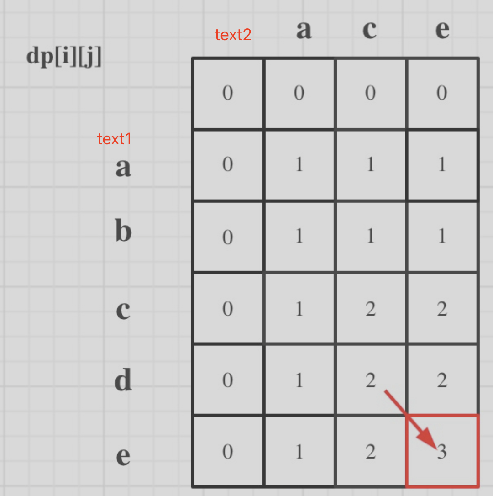

# 高频题

## 数组

### 1. 三数之和⭐️

思路：（1）排序 + 左右指针  （2）基准 和 记录结果时过滤重复值

​    [links](https://www.programmercarl.com/0015.%E4%B8%89%E6%95%B0%E4%B9%8B%E5%92%8C.html#%E5%85%B6%E4%BB%96%E8%AF%AD%E8%A8%80%E7%89%88%E6%9C%AC)

```python
class Solution:
    def threeSum(self, nums: List[int]) -> List[List[int]]:
        result = []
        nums.sort()
        for i in range(len(nums)-2): # 0~n-3  必须三个数
            # # 第二个元素开始 判断当前元素与之前元素重复则跳过
            if i > 0 and nums[i] == nums[i - 1]:
                continue
                
            left，right = i + 1，len(nums) - 1
            while left<right: # 不要等号  必须三个数
                total = nums[i] + nums[left] + nums[right]
                if total < 0:
                    left += 1
                elif total > 0:
                    right -= 1
                else:
                    result.append([nums[i], nums[left], nums[right]]) # 记录一组解
                    
                    # 两者都判断下一个元素，过滤相同解
                    while left<right and nums[right] == nums[right-1]:
                        right -= 1
                    while left<right and nums[left] == nums[left+1]:
                        left += 1
                    # 走到相同元素的边界，再走一步
                    right -= 1
                    left += 1
        return result
```


### 2. 接雨水

双指针思路： 1. 构建左最大值数组，包含自身  2. 右最大数组  3. 计算接水量，注意两侧柱子不存水

```python
class Solution:
    def trap(self, height: List[int]) -> int:
        # 边界条件
        if len(height)<3:
            return 0
        
        # 1. 构建左最大
        left_max=[0]*len(height)
        left_max[0]=height[0]
        for i in range(1,len(height)): 
            left_max[i]=max(left_max[i-1],height[i])
        
        # 2. 构建右最大
        right_max=[0]*len(height)
        right_max[-1]=height[-1]
        for i in range(len(height)-2,-1,-1):
            right_max[i]=max(right_max[i+1],height[i])
        # 3. 计算接水量
        count=0
        for i in range(1,len(height)-1):
            count+=max(min(left_max[i],right_max[i])-height[i],0)
        return count
```


### 3. 数组中的第K个最大元素

思路：快排取K    堆排序   

```python

```

## 动态规划

### 1. 最短编辑距离⭐️

[links](https://www.programmercarl.com/0072.%E7%BC%96%E8%BE%91%E8%B7%9D%E7%A6%BB.html#%E7%AE%97%E6%B3%95%E5%85%AC%E5%BC%80%E8%AF%BE)  两个单词 word1 和 word2，将 word1 转换成 word2 所使用的最少操作数 

1. dp定义：dp[i] [j] 表示以下标i-1为结尾的字符串word1，和以下标j-1为结尾的字符串word2的最短编辑次数

2. 递推公式

   - 如果当前两个元素相等，则不操作 `dp[i] [j] = dp[i-1] [j-1]`

   - 不相等，需要增删改  `min(dp[i-1][j]+1, dp[i][j-1]+1), dp[i-1][j-1]+1)`

     - 删除/增加：word1删除则`dp[i-1][j]+1`   或者  word2删除 `dp[i][j-1]+1)`

       word1删除一个字符   等价于 word2增加一个字符

     - 改：`dp[i-1][j-1]+1`

3. 顺序

   

   

   

```python
class Solution:
    def minDistance(self, word1: str, word2: str) -> int:
        # word1 行   word2列  从空开始,下标1~n才代表元素
        # dp[i][j]  word1是0~i-1 word2是0~j-1 的最小编辑距离
        # 递推公式
            # 当前两个元素如果相等，则dp[i-1][j-1]
            # 不等，需要 插入/删除  等价。或  替换， 取最小
            	# 删除  dp[i-1][j]+1   dp[i][j-1]   
            	# 替换 dp[i-1][j-1]+1 
        dp=[ [float("inf")] * (len(word2)+1)  for _ in range(len(word1)+1)]

        # 初始化
        dp[0][0]=0
        for i in range(1,len(word1)+1): # 取值范围1~n
            dp[i][0]=i
        for j in range(1,len(word2)+1): # 取值范围1~n
            dp[0][j]=j
        
        for i in range(1,len(word1)+1):
            for j in range(1,len(word2)+1):
                # 当前元素是否相等
                if word1[i-1]==word2[j-1]:
                    dp[i][j]=dp[i-1][j-1]
                else:
                    # 删除  插入等价
                    dp[i][j]=min(dp[i-1][j]+1,dp[i][j-1]+1,dp[i-1][j-1]+1)
        return dp[-1][-1]
```

### 2. 最长回文子串⭐️

[links](https://github.com/youngyangyang04/leetcode-master/blob/d3ae53e107a871c73b2d08094d586a9b711ee105/problems/0005.%E6%9C%80%E9%95%BF%E5%9B%9E%E6%96%87%E5%AD%90%E4%B8%B2.md)

动态规划

```python
# 动态规划
class Solution:
    def countSubstrings(self, s: str) -> int:
        dp = [[False] * len(s) for _ in range(len(s))]
        result = 0
        for i in range(len(s)-1, -1, -1): #注意遍历顺序
            for j in range(i, len(s)):
                if s[i] == s[j]:
                    if j - i <= 1: #情况一 和 情况二
                        result += 1
                        dp[i][j] = True
                    elif dp[i+1][j-1]: #情况三
                        result += 1
                        dp[i][j] = True
        return result
```

双指针

```python
class Solution:
    def longestPalindrome(self, s: str) -> str:
        # 奇数子串  偶数子串
        def expand(left,right,s):
            # 往外拓展 找最长子串
            while left>=0 and right<len(s) and s[left]==s[right]:
                left-=1
                right+=1
            return s[left+1:right] # while终止时，往外多扩了一次  所以左开右闭
        
        long_str=""
        for i in range(len(s)):
            odd_str= expand(i,i,s)
            even_str=expand(i,i+1,s)
            long_str = max(long_str,odd_str,even_str,key=len)
        return long_str
```

### 3. 最长公共子序列

[Links](https://www.programmercarl.com/1143.%E6%9C%80%E9%95%BF%E5%85%AC%E5%85%B1%E5%AD%90%E5%BA%8F%E5%88%97.html)  两个字符串的最长公共子序列的长度



[Links](https://www.programmercarl.com/1143.%E6%9C%80%E9%95%BF%E5%85%AC%E5%85%B1%E5%AD%90%E5%BA%8F%E5%88%97.html)

1. dp定义：dp[i] [j]长度为0~i-1的字符串text1与长度为0~j-1的字符串text2的最长公共子序列   
   - 两个字符串都是从空字符开始
2. 递推公式：
   - text1[i - 1] 与 text2[j - 1] 单个字符相同，则dp[i] [j] = dp[i - 1] [j - 1] + 1
   - text1[i - 1] 与 text2[j - 1]单个字符不相同，则dp[i] [j] = max(dp[i - 1] [j], dp[i] [j - 1])
3. 初始化：dp[i] [0] = 0     dp[0] [j]=0

4. 顺序

   

5. 举例

```python
class Solution:
    def longestCommonSubsequence(self, text1: str, text2: str) -> int:
        # 两个字符串都从空开始 故都加1    text1是行   text2是列
        dp = [[0] * (len(text2) + 1) for _ in range(len(text1) + 1)]
        
        for i in range(1, len(text1) + 1): # text1 范围1~n
            for j in range(1, len(text2) + 1): # text2 范围1~n 
              	# 如果当前两个字符相等，则左上角位置+1
                if text1[i-1] == text2[j-1]: # 0代表空字符,所以取i j对应的值都需要-1  
                    dp[i][j] = dp[i-1][j-1] + 1
                else:
                    # 如果不等，则当前位置的最长公共子序列长度为上方或左方的较大值
                    dp[i][j] = max(dp[i-1][j], dp[i][j-1])
        
        # 返回最长公共子序列的长度
        return dp[len(text1)][len(text2)]
```

### 4. 最长连续递增序列

[links](https://www.programmercarl.com/0674.%E6%9C%80%E9%95%BF%E8%BF%9E%E7%BB%AD%E9%80%92%E5%A2%9E%E5%BA%8F%E5%88%97.html)  整数数组中找出最长严格递增子序列的长度

[Links](https://www.programmercarl.com/0300.%E6%9C%80%E9%95%BF%E4%B8%8A%E5%8D%87%E5%AD%90%E5%BA%8F%E5%88%97.html#%E7%AE%97%E6%B3%95%E5%85%AC%E5%BC%80%E8%AF%BE)

1. dp定义: dp[i]表示**0~i范围**且**nums[i]结尾**的最长递增子序列的长度
2. 递推公式：j从0到i-1各个位置的最长升序子序列 + 1 的最大值
3. 初始化：每一个i，dp[i]起始大小至少都是1

```python
class Solution:
    def lengthOfLIS(self, nums: List[int]) -> int:
        if len(nums) <= 1:
            return len(nums)
        dp = [1] * len(nums)  # 序列长度至少为1
        dp[0]=1 #初始化
        for i in range(1, len(nums)): # 从第二个开始看递增子序列  范围1~n-1
            for j in range(i): # 取值0~i-1
                if nums[j] < nums[i]: # 大于才有可能成为最长序列的结尾元素
                    dp[i] = max(dp[i], dp[j] + 1)    
        return max(dp)
```

### 5 . 单词拆分- 背包正好装满

[Links](https://www.programmercarl.com/0139.%E5%8D%95%E8%AF%8D%E6%8B%86%E5%88%86.html)  单词列表是否能拼出字符串（完全背包）

- 递推公式：如果dp[j] 是True，且 [j, i] 这个区间的子串出现在单词列表里，则dp[i]一定是true。（j < i ）

- 求排列有序，先背包后物品

```python
class Solution:
    def wordBreak(self, s: str, wordDict: List[str]) -> bool:
        dp = [False]*(len(s) + 1)
        dp[0] = True
        for i in range(1, len(s) + 1):  # 先背包  1~n   背包还是从0开始
            for j in range(i):# 后物品  j范围0~i-1  i目前未知
                if dp[j] and s[j:i] in wordDict:
                    dp[i]=True
                    break
        return dp[len(s)]
```


## Todo

1. 柱状图中的最大矩形